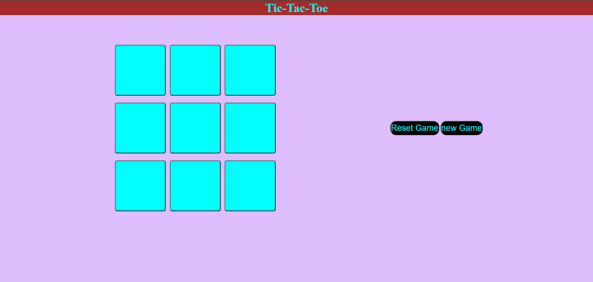

# 🎮 Mini Games Collection

A fun collection of browser-based games built using HTML, CSS, and JavaScript.  
All games are fully responsive and playable online via GitHub Pages.

---

## 🕹️ Individual Game Links

| Game                         | Live Demo Link                                                                                    |
|------------------------------|---------------------------------------------------------------------------------------------------|
| 🪨✂️📄 Rock Paper Scissors  | [▶️ Play Now](https://saahil-sahu.github.io/JavaScript-Practice-Questions/Rock-Paper-Scissors/)  |
| ❌⭕ Tic Tac Toe            | [▶️ Play Now](https://saahil-sahu.github.io/JavaScript-Practice-Questions/tic-tac-toe/)           |

> More games coming soon... 🛠️

---
### 🖼️ Preview

#### 🪨✂️📄 Rock Paper Scissors  

#### ❌⭕ Tic Tac Toe  

---

## 📬 Contact Me

**GitHub**: [@saahil-sahu](https://github.com/saahil-sahu)  
**LinkedIn**: [sahil-r-sahu](https://www.linkedin.com/in/sahil-r-sahu/) 

---
## 👨‍💻 Author

**Saahil Sahu**  

---

> ⚠️ These games are built for educational purposes only. No user data is collected or stored.
